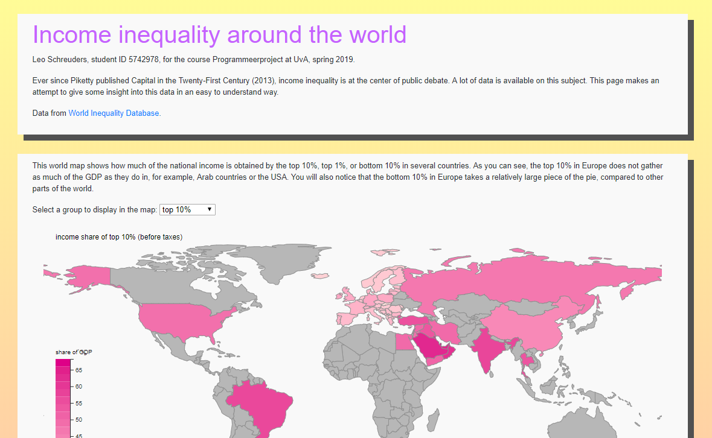
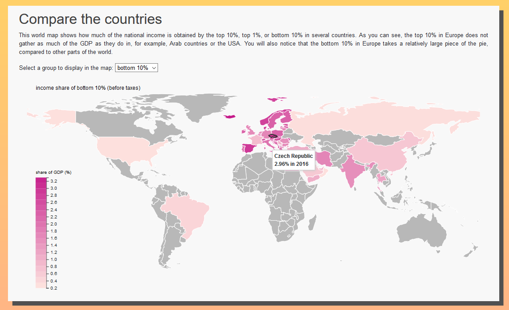
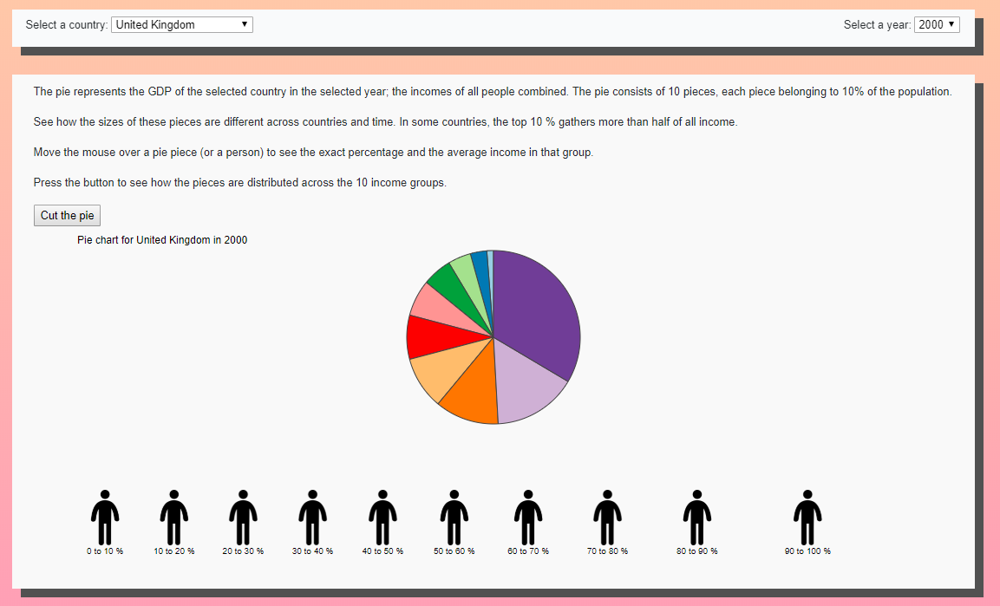
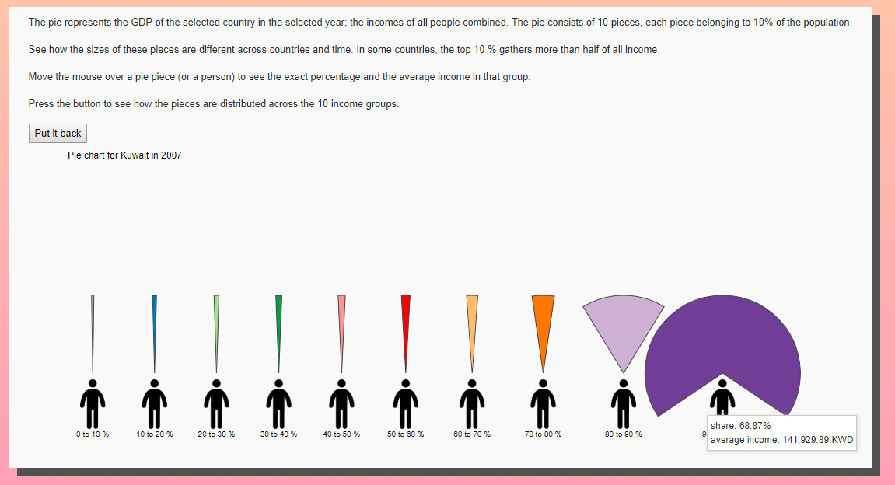
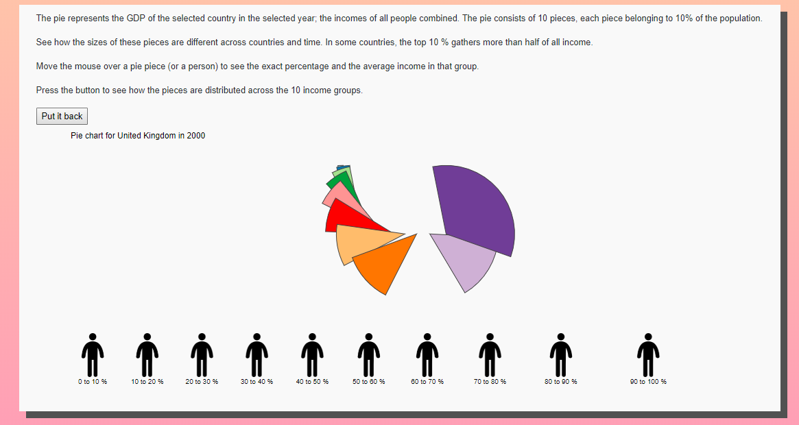
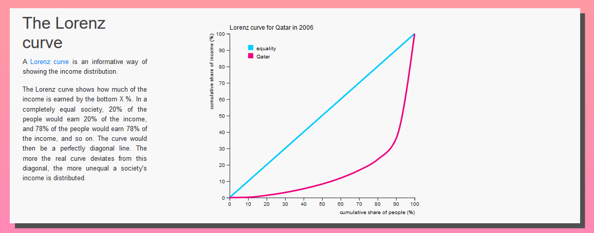
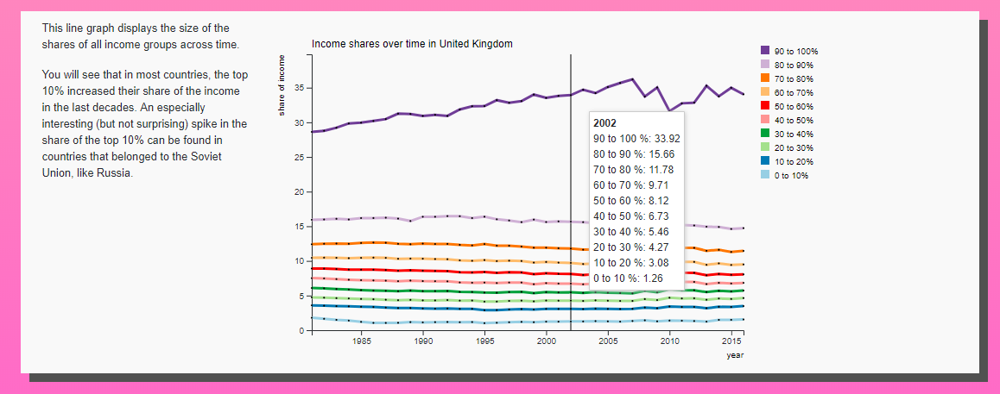

# Income inequality around the world

https://lodewikus2000.github.io/inequality/

## Problem statement

Data on inequality is widely available, but there is no easy to understand visualization of this data. This website should change that.

## Solution

The solution is a visualization of inequality data in human terms, for people who are not experts at readings graphs, mainly focused on income inequality, in a relatable way.

### Main features

#### Top

#### Map

#### Pie chart

#### Lorenz curve

#### Line chart

### Data sources
https://wid.world/

### External components
D3 datamap,

### Sources

Help with the updating of the pie:
https://bl.ocks.org/adamjanes/5e53cfa2ef3d3f05828020315a3ba18c/22619fa86de2045b6eeb4060e747c5076569ec47

Help for the line graph:
https://bl.ocks.org/d3noob/402dd382a51a4f6eea487f9a35566de0/
