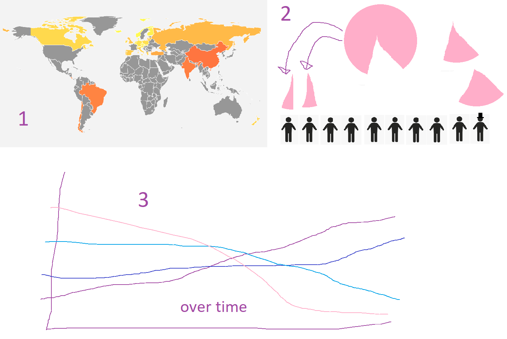
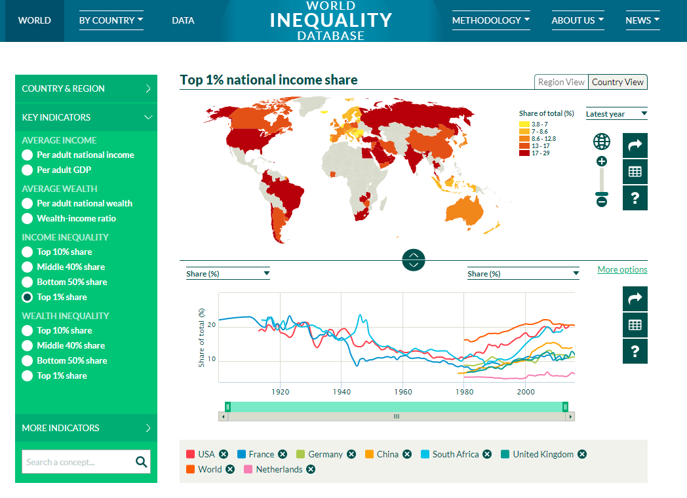

# inequality

https://lodewikus2000.github.io/inequality/

## Problem statement

Data on inequality is widely available, but there is no easy to understand visualization of this data. Complicated line graphs of gini coefficients or bar charts of share of the 1% mean don't communicate the data clear enough.

## Solution

The solution is a visualization of inequality data in human terms, for people who are not experts at readings graphs, mainly focused on income inequality, in a relatable way.

### Main features

#### Minimum viable product
View 1 : a world map where the user can select a country. Country color based on share of top 10%, top 1%, or bottom 10%.
View 2: a country's national income divided over 10 people. The representation of the share of income is a pie chart, and the pieces of the pie chart can be distributed over the 10 people.
View 3: Lorenz curve based on the data.
View 4: a graph view: something over time?

#### Optional
Information about inequality when it comes to health, government spending on social programs.

## Prerequisites

### Data sources
https://wid.world/
https://data.oecd.org/

### External components
D3 datamap,

### Similar visualizations

Take this example from the World Inequality Database:

It's unclear what the % share buttons do, the line graph at the bottom is not too informative. The whole visualization does not communicate anything to anyone who is not already very interested in this subject.

### Hardest parts

Animations, combining data from several databases.

### Sources

Help with the updating of the pie:
https://bl.ocks.org/adamjanes/5e53cfa2ef3d3f05828020315a3ba18c/22619fa86de2045b6eeb4060e747c5076569ec47

Help for the line graph:
https://bl.ocks.org/d3noob/402dd382a51a4f6eea487f9a35566de0/
