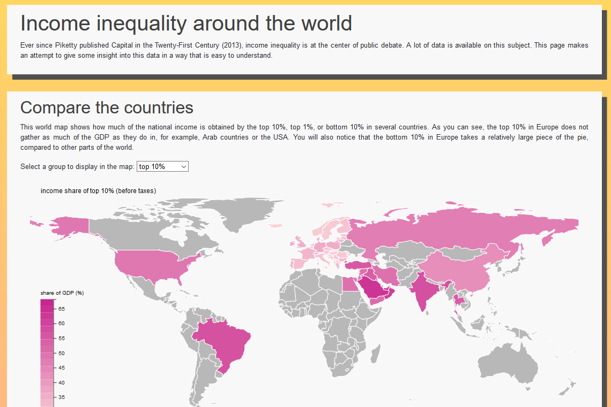
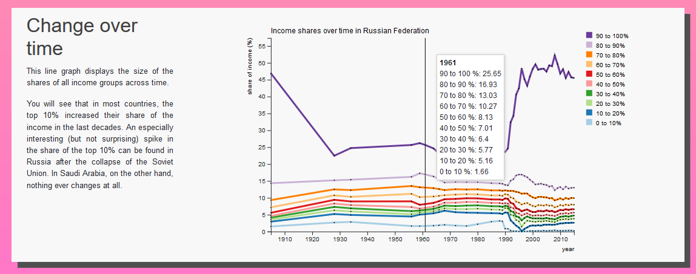

# Income inequality around the world

## Link
https://lodewikus2000.github.io/inequality/

## Video
https://youtu.be/vcVdB14DPDo

## The website

This website shows income inequality data in a way that is easy to understand.

### Main features

#### Map
This is the first thing the user sees. By default, the map shows the size of the share of the top 10%. The user can choose to switch the view to the top 1% or bottom 10%. The legend and colors will update using an animation.

Clicking a country will move the view down to the pie chart (if there is data available on the clicked country).

#### Navigation bar
The sticky navigation bar first appears above the pie chart, but moves with the view as the user scrolls over the pie chart, Lorenz curve, and line chart. With the navigation bar, the user can select a different country and year to view.

#### Pie chart
The pie chart shows how big each group's slice of the pie is, where the pie is the national income. The user can choose to spread the slices over the ten income groups (using a beautiful animation), represented by 10 icons of humans. Moving the cursor over the slices or the icons informs the user of the exact percentage of each group, and of the average income in that group. Spreading the slices gives an intuitive idea of the differences in share sizes. The pie is updated with an animation as the user selects a different country or year.

#### Lorenz curve
The Lorenz curve is a way of showing the cumulative income distribution. It is updated with an animation as the user selects a different country or year.

#### Line chart
The line chart shows the development of income shares over time for the ten groups that are also shown in the pie chart. Moving the mouse over the graph shows the exact number for every group. It is updated with an animation as the user selects a different country.

### Data source
https://wid.world/

### External components
- D3
- D3 datamap
- Bootstrap

The script to process the data uses:
- pandas
- csv
- json
- pycountry_convert

### Sources

Updating of the pie chart:
https://bl.ocks.org/adamjanes/5e53cfa2ef3d3f05828020315a3ba18c/22619fa86de2045b6eeb4060e747c5076569ec47

Line graph:
https://bl.ocks.org/d3noob/402dd382a51a4f6eea487f9a35566de0/

Human icon:
https://www.flaticon.com/free-icon/standing-frontal-man-silhouette_10633#term=frontal%20man&page=1&position=1

Pie chart and line graph colors from:
http://colorbrewer2.org

#### License

Income inequality around the world by Leo Schreuders is licensed under a Creative Commons Attribution-ShareAlike 4.0 International License.

D3 licensed under https://github.com/d3/d3/blob/master/LICENSE.
