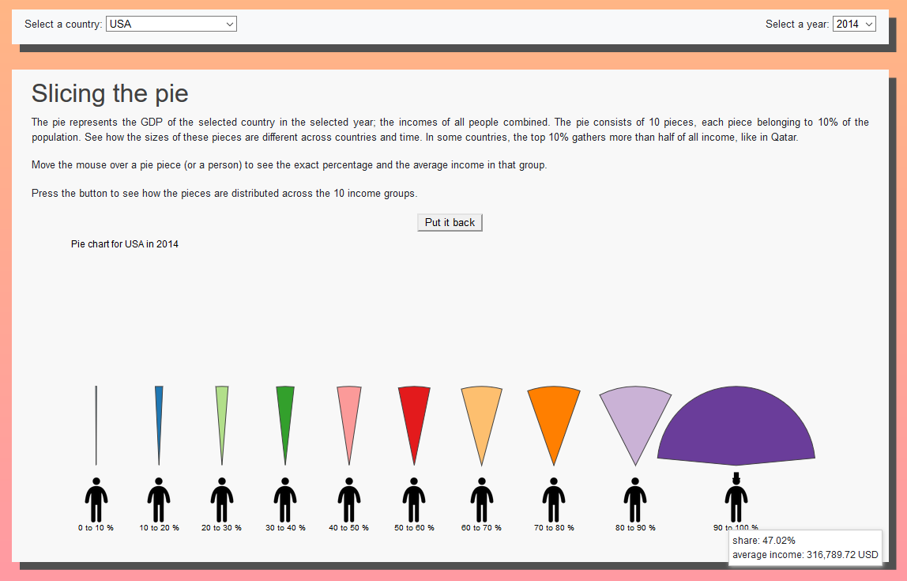

# Income inequality around the world

## Link
https://lodewikus2000.github.io/inequality/

## The website

This website shows income inequality data in a way that is easy to understand, with nice looking, simple graphs.

## Technical design

### Overview

Data from the World Inequality Database is processed with csv2json.py.

The website (index.html) loads several files from other parties in the head:
- boostrap.min.css (external source)
- index.css
- d3.v5.js
- d3.v3.min.js
- topojson.min.js
- datamaps.world.min.js

The page then loads (also in the header):
- drawMap.js
- drawPie.js
- drawLorenz.js
- drawLine.js

Finally, in the body it executes inequality.js.

### inequality.js
This is the main javascript file that calls all functions. It loads the data with a json request, then draws the graphs and fills the html elements with options. Here, we also set some global variables that are used by the other javascript files.

### drawMap.js

#### drawMap(dataset)
The main function drawMap first remembers the dataset in dataHere, so that it can be used by its update function. Here, we also remember if the pie is slices or not in the boolean divided. It then initializes a map and all the necessary g, axis, and title elements, after which it calls its own update function to fill the map for the top 10%.
In currentData, this function remembers which selection of the data it is currently displaying, which is useful for the tooltip.
Clicking on a country calls drawPie.updateCountry, drawLine.updateCountry, and drawLorenz.updateCountry. It also sets the html select element to the country that was clicked.

Initially, the people were spread out linearly accross the svg bottom, but this caused a problem with the share of the top 10 percent overlapping with the share of the 80-90 percent. Now, a complicated looking but simple formula spreads them out semi-exponentially. 80 percent of the distance between the people is still linear, and 20 percent is based on an exponential formula.

#### drawMap.update(percentile, speed)
This function selects the given percentile from the data, and then makes a new colormap that is then given to the datamap with map.updateChoropleth. Title and legend are also updated.

### drawPie.js

#### drawPie(dataset, currencies)
This function remembers the dataset in dataHere and currencies in currenciesHere so that it can be used by its own sub-functions. It keeps track of what it is currently displaying in currentData and currentCountry. It initializes elements that will be updated in the subfunctions, like the g elements, text elements, sets functions for the pie chart, and places 10 people icons on the svg.
Its updateCountry function needs to be called before it actually displays anything useful.

#### updateYear(year, speed)
Here we filter data from dataHere and save it in currentData, and enter the new data in the paths for the slices. If the slices were spread out, we run that function (divide) again, so that the pieces will be centered again.

#### updateCountry(country, speed)
Same as updateYear, but we filter for a country. We find the newest year for which data is available, and display that year.

#### divide(speed)
This function selects the slices, translates and rotates them, so they will be spread over the svg.

#### unDivide(speed)
We select the slices and put them back together.

### drawLorenz.js

#### drawLorez(dataset)
The main function remembers the dataset in dataHere, and remembers what it is displaying in currentCountry, currentYear, and currentData. It draws the parts of the graph that are not updated: the diagonal and the axes. It calls drawLegend, but its updateCountry function needs to be called before it actually displays anything useful.

#### drawLegend()
Called once. Places a simple legend in the graph.

#### updateCountry(country, speed)
We filter data from dataHere based on country, and save it in currentData. We make a new cumulative array of the data and then update the line to display the data. We find the newest year for which data is available, and display that year.

#### updateYear(year, speed).
Same as updateCountry, but we filter on year.

### drawLine.js

#### drawLine(dataset)
This main function remembers the dataset in datahere. It keeps track of what it is displaying in currentData (which is accessed by the tooltip). We set axes, scales, g-elements, text elements, but don't really draw a lot yet. We call drawLegend.

#### drawLegend()
This places a legend on the right of the graph. Called once.

#### removeTooltip()
Called when the mouse leaves the graph. It removes the tooltip.

#### drawTooltip()
Called when the mouse moves over the graph. It displays the tooltip and updates it with the data of the year that is closest to the cursor. A vertical line shows which year is being displayed.

#### updateCountry(country, speed)
Data is filtered from dataHere and saved in currentData. We select the lines and update them with the selected data.

## Challenges

### Dropping the gini coefficient
Initially, I wanted the colors of the country to be based on the gini coefficient, but the set of countries for which gini data was available was not the same as the set of countries for which income share data was avaible. This made for a confusing situation where grey countries could actually be clicked for more info, and countries with a color could not be clicked. I made the decision to drop the gini data, and just focus on the shares of GDP, as it makes the user experience much easier.

### No year selector for the map
The map was supposed to have a dropdown menu where the user could select a year to display. But not all countries have data available for the same years, so the user could not always compare all countries. Also, some countries would be greyed out, which gave the impression they were not clickable. I decided that changing the year was not too informative to begin with, as the relations between countries didn't change much over the years. I decided to remove the year selector, and just select the newest year for every country. So now the map displays data from different years, but the difference is never large.

### Not using d3 tip
The d3 tip extension proved to be not very versatile. As I use several slightly different tooltips, I needed to write my own. This turned out to be a lot easier than expected, and it made it possible to have a uniform design of the tooltip, so it was a good choice.

### The Lorenz curve
The Lorenz curve was suggested by Floris (last name unknown to me) during a meeting with Jasper, and it seemed like a good idea.

### Adding average income data
In my experience, the data as presented by the website turned out to be still a little abstract, as it did not give an impression of just how rich or poor the people in a certain income group are. As the user probably wants to know in which group she belongs, I ended up adding data for the average income per income group. It is displayed in a tooltip when mousing over the pie slices or humans. I did this in the last week. If there had been more time, I would have chosen a more prominent way to display this information.

### Adding currency data
The average income data from the WID shows the number without the currency. The currency is given in a metafile. I ended up processing that dat as well, as "123,000 USD" is a lot more meaningful than "123,000 local currency".
